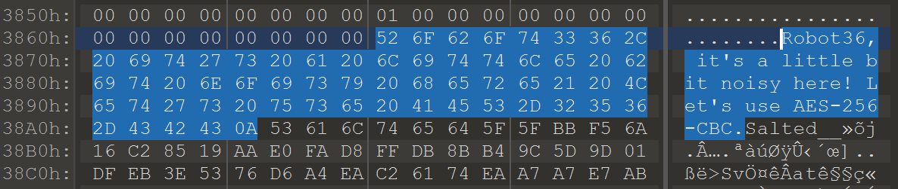

# Can You Hear Me

## Message

> OoOoOOO, it's a little bit noisy here.

## Setup

Read `encode.sh` and `clean.sh`

``` bash
# Python 3
pip install pillow pySSTV
```

## Usage

```bash
echo "ExampleFlag" > flag.txt
./encode.sh
./clean.sh
```

## Get Flag

```bash
binwalk -D=".*" can_you_hear_me.exe 
cd _can_you_hear_me.exe.extracted
openssl enc -d -aes-256-cbc -in 38A5 -out flag.tar # Password: Robot36
tar xf flag.tar
```

```bash
sudo apt install libsdl1.2-dev
git clone https://github.com/xdsopl/robot36
cd robot36
make
./decode flag.wav
```

## Writeup

对给出的文件使用 binwalk 可以发现文件末尾存在 OpenSSL 加密文件，并且能看到一句话 `Robot36, it's a little bit noisy here! Let's use AES-256-CBC`，根据题目提示猜测 `Robot36` 为该 AES-256-CBC 的密钥。




提取并解密该加密文件后，可以发现为 tar 打包文件，解压后可以得到 flag.wav。使用 Robot36 解码软件解码该音频即可得到 flag。


