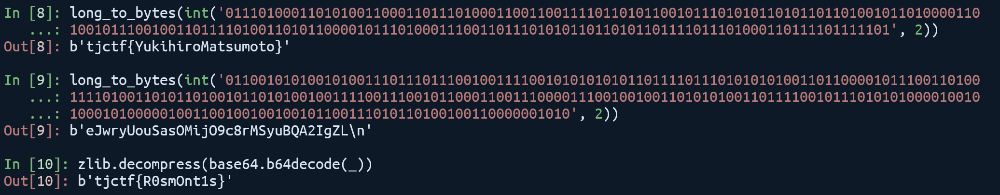

# Ruby Ruby

## Description

> Is it possible to compile Ruby?


## Usage

For Ruby 3

Read `encode.rb` and change the last line.

Run `ruby encode.rb` to generate `flag.rb`

Run `ruby decode.rb 2>/dev/null` to get the flag.

## Writeup

使用二进制查看器可以得知该文件为 Ruby 字节码，可以通过 `RubyVM::InstructionSequence` 加载并反编译该 Ruby 字节码

```ruby
byte_code = File.read "flag.rb"
instruction_from_byte_code = RubyVM::InstructionSequence.load_from_binary byte_code
puts RubyVM::InstructionSequence.disasm instruction_from_byte_code
```

反编译后可以看到 zlib 和 base64，以及两串 `01` 组成，解码后其中一个为假 flag，另一个为使用 zlib 和 base64 加密后的字符串，解密后即为 flag。


