# Gitty RSA 解答

题目：

> We find some suspicious activities in our organization's network...

## 找到流量中的目标

题目给了一个名叫 `out.pcapng` 的文件，可以看出来它是一个流量截获文件：

## 怎么打开这个文件

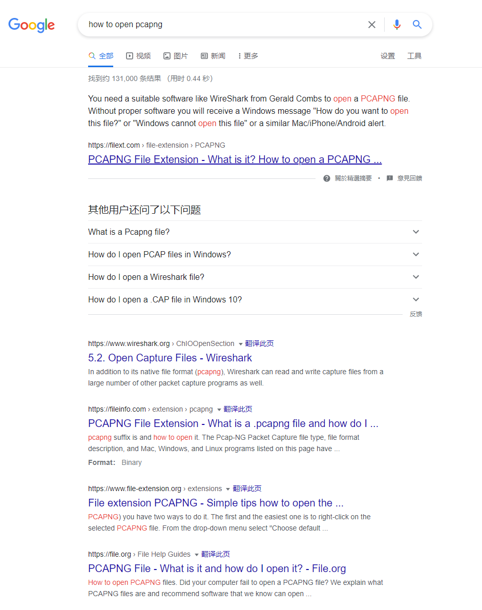

## 稍微浏览一下文件……

在 Wireshark 顶部有可以筛选所截获的包。

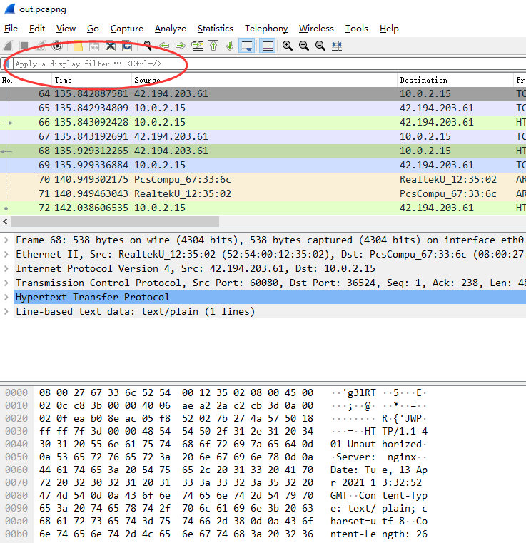

题目中提到了 `git`，那么让我们先来看看 `http` 对象：

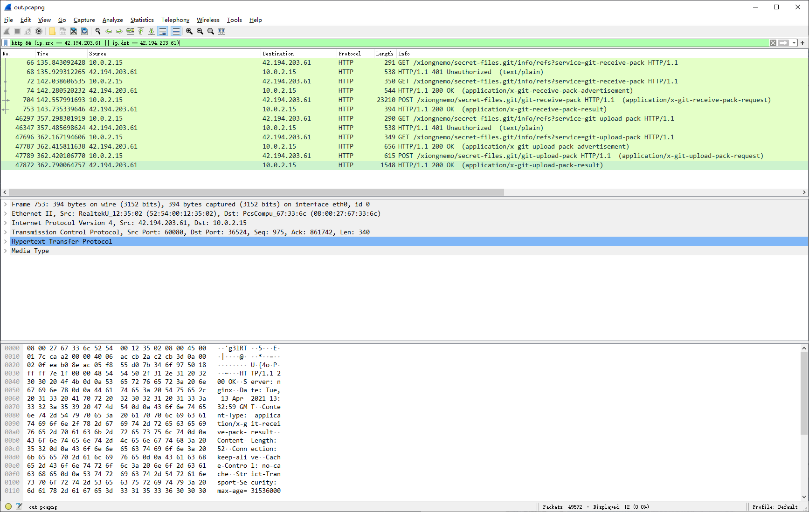

导出对象：

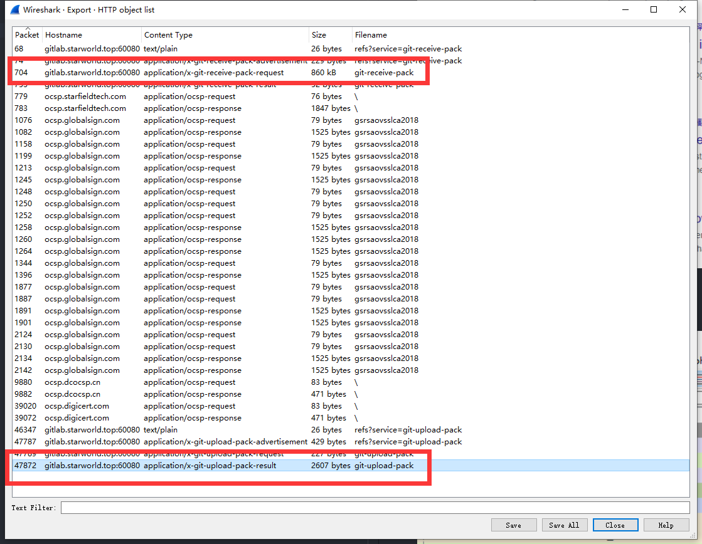

导出为以下两个文件：

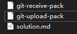

## 解包 git pack

直接进行一个 walk 的 bin

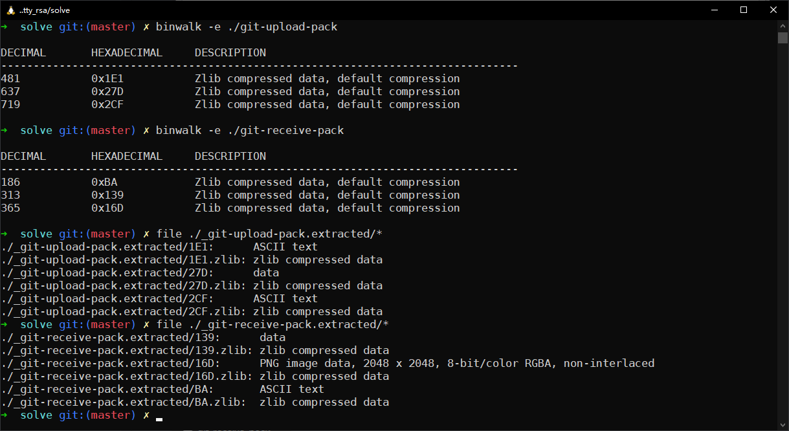

## 研究内容

先看看 upload pack

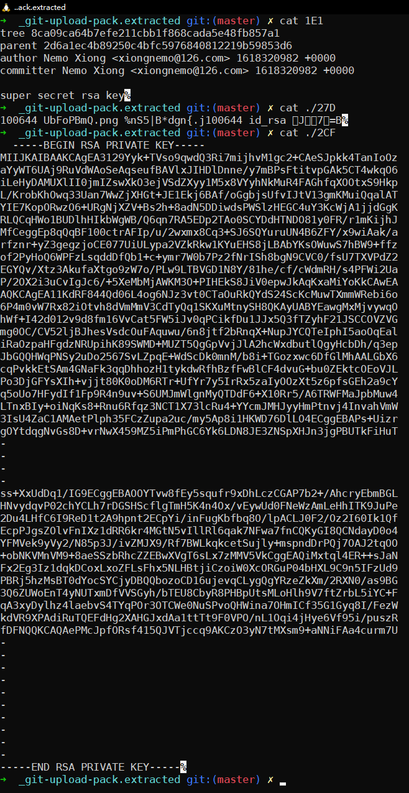

再看看 receive pack

从 upload pack 中，我们看到了一个不完整的 RSA 私钥。

从 receive pack 中，我们看到了一个图片。

## 从不完整的 RSA 私钥中恢复私钥

[source](https://blog.cryptohack.org/twitter-secrets)

准备好一个 base64 to hex 转换器，从不完整的私钥中获取部分信息然后跟着做吧。

过程可以看 `crack_rsa.ipynb`

（OSINT 题目实锤）

## 从图片中获取信息

做得挺简单的。

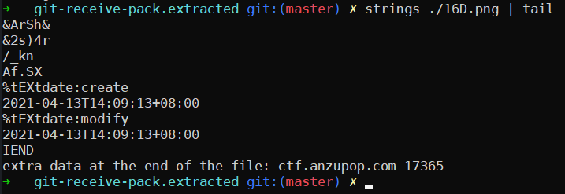

## 连接服务器

都有了这两个大概能猜出这是个什么服务了：

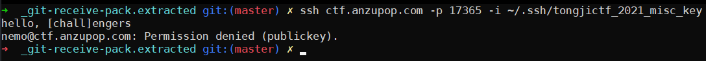

看起来这用户名不够劲，让我们换一个试试：

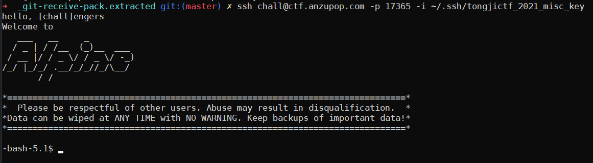

## 找到 flag

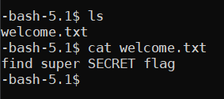

你知道该干什么：

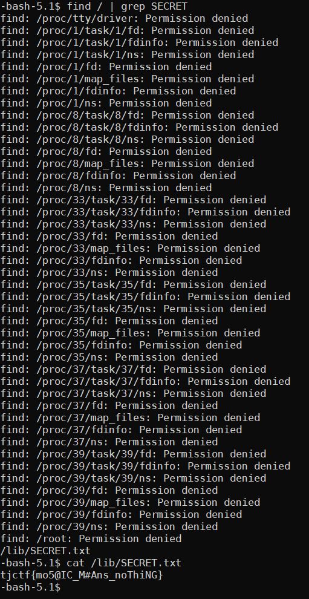
